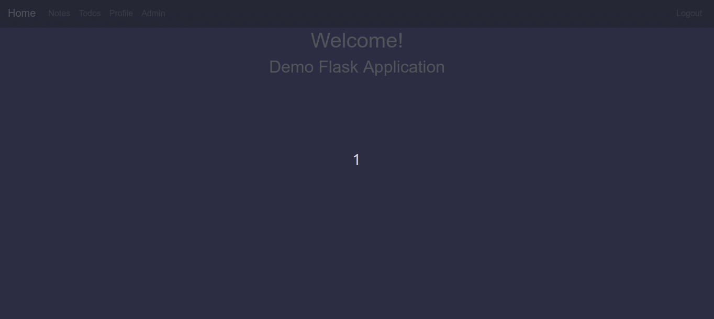

## Flask App
Simple demo app with basic CRUD functionality to handle notes/posts or todos logic.

## What's included?
* Blueprints
* Flask-Admin micro-framework for user and permissions management and CRUD functionality 
* Flask-Login for user authorization
* Flask-SQLAlchemy for databases
* Flask-Migrate for managing changes of database structure
* Flask-WTF for forms
* Flask-Mail for sending confirmation emails, reseting password
* Basic CRUD functionality for notes and todos
* Profile managment changing email and password using mail authorization with tokens

## Demos

Notes CRUD Page:

Todos CRUD Page:

User Editing Page:

Admin Page:

Registering User:

## Quick start
1. Install all dependencies in virtual environment `pipenv install`
2. Setup environment variables in example.env and rename it to just '.env' : `SECRET_KEY, MAIL_USER, MAIL_PASSWORD, SECURITY_PASSWORD_SALT` (default email provider - gmail) 
3. Run virtual environment `pipenv shell`
4. First create db  `python3 manage.py db init`
5. Create migrations `python3 manage.py db migrate`
6. Upgrade db `python3 manage.py db upgrade`
7. Creates admin user `python3 -c 'from manage import create_admin; create_admin()'` natively created with user `ad@min.com` password `Password1`, recommended to change password straightaway
8. `flask run`

## Upgrade db model
If you want to upgrade previosly created and used db ( after changes to the structure).
1. Close the app
2. `python3 manage.py db migrate`
3. `python3 manage.py db upgrade`
4. `flask run`

## License
[MIT License](LICENSE)
